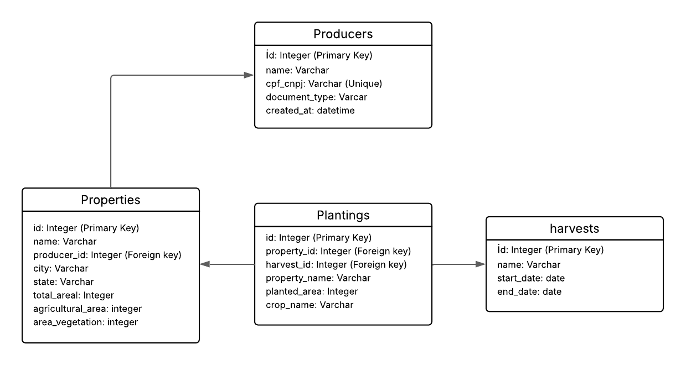

# 🌱 Brain Agriculture

**Brain Agriculture** é um sistema voltado para o gerenciamento de produtores rurais, propriedades agrícolas e culturas plantadas. Ele permite o controle completo de dados agrícolas com validações inteligentes e interface para consulta via Swagger.

---

## 📌 Funcionalidades

- Cadastro, edição e exclusão de produtores rurais.
- Cadastro, edição e exclusão das propriedades dos produtores.
- Registro de múltiplas culturas por safra em uma propriedade.
- Um produtor pode possuir nenhuma, uma ou várias propriedades rurais.
- Cada propriedade rural pode conter várias culturas por safra.

---

## 🚀 Requisitos

- Python 3.8+
- PostgreSQL rodando na porta `5432` com o banco `brain_agriculture_local`

---

## ⚙️ Configuração do Projeto

### 1. Banco de dados

#### Opção 1: Criar um banco de dados PosgresSQL local

- Nessario ter um banco de dados postgres com o nome: brain_agriculture_local rodando na porta 5432
- Configure a conexão com o banco no arquivo: /src/env.local

#### Opção 2: usar o docker-compose localizado na raiz do projeto

Utilize o comando abaixo para subir um container postgres com todas as configurações necssarias para rodar o projeto:

```
docker-compose up -d
```

### 2. Ambiente virtual

#### Crie e ative o ambiente virtual:

```
python3 -m venv venv
source venv/bin/activate  # Linux/Mac
venv\Scripts\activate     # Windows
```

#### Instale as dependências:

```
pip install -r requirements.txt
```

### 3. Atualizar o Banco de Dados

#### Você pode atualizar as tabelas com:

```
chmod +x ./update_database.sh & ./update_database.sh
# ou
alembic upgrade head
```

## 🧪 Rodando os Testes

### Execute os testes automatizados com:

```
chmod +x ./run_tests.sh & ./run_tests.sh
# ou
pytest --cov=./src --cov-report=html -W ignore::DeprecationWarning
```

Isso gerará um relatório de cobertura em htmlcov/index.html, que pode ser aberto no navegador.

## ▶️ Iniciando o Serviço

### Após configurar tudo, execute:

```
chmod +x ./startup.sh & ./startup.sh
# ou
gunicorn -b :8080 -k uvicorn.workers.UvicornWorker app:app
```

isso ira subir um serviço na porta 8080

## 📘 Documentação da API

Com o serviço em execução, acesse:

http://localhost:8080/doc/redoc

Lá você encontrará todos os endpoints disponíveis da API.

## Diagrama do banco de dados


